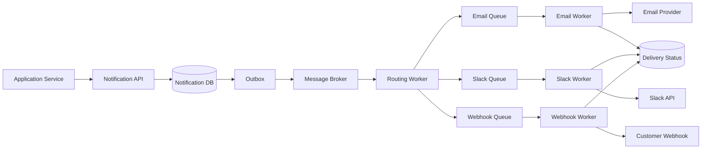

# Notification System Design 


## Problem Statement:

1. Single Point of failure
2. Server overloaded
3. Message lost
4. Deficult to scal


# Handling a fanout message


Handling a fanout message to send notifications, such as when a celebrity posts a message to all their followers, can be effectively managed using several strategies. Here’s an outline of best practices and approaches:

### 1. **Message Queue or Streaming Platform**
   - **Use Kafka or RabbitMQ**: These tools can help fan out messages efficiently. Each follower can be represented as a consumer that subscribes to messages from the celebrity.

### 2. **Topics and Subscriptions**
   - **Single Topic for Celebrity Posts**: Create a single topic (e.g., `celebrity-posts`) where all messages from celebrities are published.
   - **Partitioning**: Use partitions to distribute messages across multiple consumers for better performance and scalability.

### 3. **Fanout Mechanism**
   - **Direct Fanout**: When a celebrity posts a message, publish it to a topic that all followers subscribe to. Each follower's notification service consumes from this topic.
   - **Multiple Topics**: If needed, you can create a topic per celebrity. This can help in isolating messages and managing subscriptions more granularly.

### 4. **Notification Service Design**
   - **Service Architecture**:
     - **Producer Service**: Responsible for publishing messages to the `celebrity-posts` topic.
     - **Notification Service**: Consumes messages and handles notification delivery to followers.
     - **Database**: Store follower information, including which notifications have been sent.
   - **Batch Processing**: To reduce load, consider processing notifications in batches (e.g., sending notifications to multiple followers in one API call).

### 5. **Scaling**
   - **Horizontal Scaling**: Scale the notification service horizontally by adding more instances to handle increased load, especially during high-traffic events (e.g., celebrity events or trending topics).
   - **Dynamic Consumer Groups**: Allow dynamic scaling of consumers based on load. For example, you can spin up more consumer instances when a celebrity posts.

### 6. **Handling Delivery and Failures**
   - **Retry Mechanism**: Implement a retry mechanism for failed notification deliveries (e.g., if a push notification fails, try again later).
   - **Dead Letter Queue**: Use a dead letter queue to handle messages that fail after a certain number of retries, enabling further investigation.

### 7. **Rate Limiting**
   - **Throttle Notifications**: To avoid overwhelming users, implement rate limiting on the number of notifications sent within a specific timeframe.

### 8. **User Preferences**
   - **Notification Settings**: Allow users to customize their notification preferences (e.g., types of posts they want to receive notifications for).
   - **Opt-in/Opt-out**: Provide options for users to opt-in or opt-out of notifications from specific celebrities.

### 9. **Example Workflow for Celebrity Posting**
1. **Celebrity Posts Message**: A celebrity creates a new post (e.g., “Excited for my upcoming concert!”).
2. **Publish to Topic**: The producer service publishes the message to the `celebrity-posts` topic.
3. **Notification Service Consumes Message**: The notification service listens to the topic and receives the new post.
4. **Send Notifications**:
   - The notification service fetches the list of followers from the database.
   - It sends notifications (e.g., push notifications, emails) to all followers who opted in.
5. **Track Delivery**: The service logs the status of each notification for tracking and potential retries.

### 10. **Monitoring and Analytics**
- **Track Engagement**: Monitor how users interact with notifications to refine strategies.
- **Alerting**: Set up alerts for failures in the notification delivery process to ensure timely responses to issues.

By employing these strategies, you can effectively manage fanout messaging for notification services, ensuring timely and efficient delivery to followers of celebrities or any other entities in your application.

### Fanout message

When a celebrity posts a message, the publisher sends it to the corresponding celebrity topic. A fanout service then reads these messages and collects user data from various databases, including a graph database, user database, preference database (for opt-outs), and an infinity database (which stores information about messages received by consumers each day).

The service aggregates this data and categorizes it based on priority levels (P0, P1, P2, P3, etc.) to determine how to send the messages effectively.


Yes. At a Principal Engineer level, the interviewer is evaluating *how you think* much more than whether you can draw the perfect architecture.

The biggest difference between a Senior and a Principal answer is that a Principal engineer optimizes for **future change, operational simplicity, and failure handling**, not just getting notifications delivered.

Here's how I would approach it.

---

# Part 1 — System Design

## Step 1: Clarify Requirements (2-3 minutes)

A principal engineer doesn't immediately start drawing boxes.

They first reduce ambiguity.

I'd ask:

Functional

* Are notifications guaranteed at-least-once or exactly-once?
* Can duplicate notifications happen?
* Is ordering required?
* Are notifications generated internally only?
* Can customers retry manually?
* Are webhooks signed?
* Can customers pause notifications?

Non-functional

* Expected availability?
* SLA for security alerts?
* Regional deployment?
* Retention period?
* Compliance (GDPR)?
* Audit requirements?

Then I'd state assumptions.

Example:

> I'll assume at-least-once delivery, ordering is not required, duplicates are acceptable if idempotency keys are provided, and providers may fail for minutes to hours.

Interviewers love explicit assumptions.

---

# Step 2: Identify the difficult engineering decisions

This is the most important part.

Instead of listing services, identify irreversible decisions.

Example:

## Decision 1

**Use asynchronous event-driven delivery instead of synchronous provider calls.**

Reason

* Provider outages should never block notification generation.
* Easy to add new channels.
* Horizontal scalability.

Tradeoff

Higher complexity

Worth it because resilience matters more than latency.

---

## Decision 2

Separate notification creation from channel delivery.

Instead of

```
API

↓

Send Email

↓

Send Slack

↓

Send Webhook
```

Do

```
Notification

↓

Routing

↓

Channel Jobs

↓

Workers
```

Reason

Each channel has different SLAs.

Slack may fail.

Email may succeed.

Webhook may timeout.

Independent retries.

---

## Decision 3

Persist before publishing.

Never publish an event before it exists in durable storage.

Use Outbox Pattern.

Reason

Avoid lost notifications during crashes.

---

These three decisions matter far more than discussing PostgreSQL vs MySQL.

---

# Step 3: High-Level Architecture



Notice this isn't complicated.

Principal engineers prefer simple systems.

---

# Data Flow

### Step 1

Application creates notification.

↓

Persist notification.

↓

Persist outbox event.

---

### Step 2

Outbox publisher publishes to Kafka/SQS/RabbitMQ.

---

### Step 3

Routing worker reads notification.

Looks up customer preferences.

Generates delivery jobs.

Example

```
Notification

↓

Customer Config

↓

Email

Slack

Webhook
```

---

### Step 4

Workers independently send notifications.

Each worker updates status.

---

### Step 5

Failures retry with exponential backoff.

After N retries

↓

Dead Letter Queue

---

# Why separate routing?

Many people miss this.

Routing is business logic.

Delivery is infrastructure.

If customer changes preferences

```
Security Alert

↓

Email + Slack

Weekly Digest

↓

Email only
```

No delivery code changes.

Only routing changes.

That's a clean separation.

---

# Failure Handling

A principal engineer spends a lot of time here.

Provider timeout

↓

Retry

↓

Circuit breaker

↓

DLQ

↓

Alert

---

Email provider down

Only Email Queue grows.

Slack continues working.

Webhook continues working.

No cascading failures.

---

# Scaling

Peak

500/sec

Future

1500/sec

Design

Stateless services

Horizontal workers

Broker partitions

Independent queues

Channel isolation

Auto scaling

Nothing fancy.

---

# Data Model

Notification

```
id

customerId

type

payload

status

createdAt
```

Customer Preferences

```
customerId

notificationType

channels[]
```

Delivery Job

```
id

notificationId

channel

status

attempts

nextRetry
```

Simple.

---

# Observability

Metrics

* Notifications created/sec
* Queue depth
* Retry count
* Provider latency
* Failure %
* DLQ size

Logs

Correlation ID

Notification ID

Tracing

API

↓

Routing

↓

Worker

↓

Provider

---

# Security

Webhook signatures

Secrets in Vault

Encrypt payloads

RBAC

Audit log

Principal engineers always mention security.

---

# Phase Plan

This matters a lot.

Don't build everything first.

---

## Phase 1

Core notification pipeline

* API
* Database
* Routing
* Email only
* Retry
* Basic metrics

Goal

Customers receive notifications reliably.

---

## Phase 2

Slack

Webhook

DLQ

Backoff

Circuit breaker

Idempotency

---

## Phase 3

Scheduling

Weekly digests

Batching

Rate limiting

Analytics

Admin dashboard

---

Interviewers like seeing incremental value.

---

# Part 2 (Implementation)

This is where many candidates fail.

Do NOT try to build the entire architecture.

Implement exactly Phase 1.

Example project

```
controller

NotificationController

service

NotificationService

repository

NotificationRepository

worker

EmailWorker

queue

InMemoryQueue

model

Notification

Channel

Status

config
```

Flow

```
POST /notifications

↓

Save Notification

↓

Enqueue Email Job

↓

Worker

↓

Fake Email Provider

↓

Update Status
```

No Slack.

No webhook.

No Kafka.

No RabbitMQ.

No scheduler.

No retries if time runs out.

The interviewer knows it's 30 minutes.

Quality > completeness.

---

# Good assumptions to document

```
Assumptions

• At-least-once delivery
• Ordering not required
• One email provider
• Notification payload <100 KB
• Customer config cached in memory
• Email provider mocked
```

---

# AI Reflection

Example

> I used AI to validate architectural alternatives and review my API naming. I rewrote the architecture explanation to align with the assumptions I made and implemented the notification workflow myself. I deliberately implemented the queue processing logic and domain model without AI so I could ensure the design reflected my own understanding of the tradeoffs.

---

# What a Principal Engineer Is Really Being Evaluated On

The strongest signal is not whether you mention Kafka, Redis, or Spring Boot—it's whether your design demonstrates sound engineering judgment.

A principal-level answer typically shows:

* **Clear assumptions** before designing.
* **Separation of concerns** (notification creation, routing, and channel delivery are independent).
* **Resilience by default**, with durable persistence, retries, dead-letter queues, and isolation of failing providers.
* **Incremental delivery**, choosing a Phase 1 that provides customer value without overbuilding.
* **Operational thinking**, including observability (metrics, logs, tracing), scaling strategy, and failure modes.
* **Explicit trade-offs**, explaining why certain decisions (like asynchronous processing or the Outbox pattern) are worth their added complexity.

# What do you mean by B2B SaaS product

**B2B SaaS** stands for:

* **B2B (Business-to-Business):** The product is sold to **companies**, not individual consumers.
* **SaaS (Software as a Service):** The software is hosted in the cloud and customers access it over the internet (usually via a subscription).

### Example

Imagine you build a **Project Management SaaS** (similar to Jira or Asana).

Your customers are companies like:

* Company A (100 employees)
* Company B (500 employees)

Your notification service sends events such as:

* **Security Alert:** "Your password was changed."
* **Task Assigned:** "A new task has been assigned to you."
* **Weekly Digest:** "Here is your team's weekly activity summary."

Each company can configure how they want to receive notifications:

| Notification Type | Company A     | Company B       |
| ----------------- | ------------- | --------------- |
| Security Alert    | Email + Slack | Email + Webhook |
| Weekly Digest     | Email         | Slack           |
| Task Assigned     | Slack         | Email + Slack   |

So when **Company A** has a security alert:

```
Application
      │
      ▼
Notification Service
      │
      ├── Email → user@companyA.com
      └── Slack → #security-alerts
```

When **Company B** has the same security alert:

```
Application
      │
      ▼
Notification Service
      │
      ├── Email → admin@companyB.com
      └── Webhook → https://companyb.com/webhook
```

### Why this matters in your interview

The key point is that you're **not building Gmail or Slack**. You're building a **notification platform used by many customer organizations (tenants)**, where **each customer has different notification preferences and integrations**. This multi-tenant configurability is a core characteristic of a B2B SaaS notification service.


